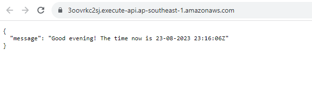

# CI/CD Pipeline for Serverless Nodejs Application: Including Secrets Management, Package Vulnerability Scanning and Logging

Welcome to this guide on setting up a Continuous Integration and Continuous Deployment (CI/CD) pipeline for a serverless Node.js application hosted on AWS Lambda. As serverless architectures become more popular due to their scalability and cost-effectiveness, the importance of a robust CI/CD pipeline has never been more paramount. This ensures that every piece of code deployed to production is of the highest quality, secure, and free from vulnerabilities.

By going through this guide, you will be:
- Creating a simple Node.js application that provides personalized greetings based on the Singapore timezone.
- Setting up a CI/CD pipeline using GitHub Actions, which will handle tasks such as dependency installation, unit testing, and vulnerability scanning.
- Deploying the application seamlessly to AWS Lambda with the Serverless Framework.
- Ensuring security by handling secrets appropriately using AWS Secrets Manager.
- Implementing logging using Winston.

## Prerequisites

Before diving into the pipeline setup, make sure you have the following prerequisites satisfied:
- Nodejs installed
- Serverless Framework installed
- AWS Account
- AWS credentials stored in Github Secrets (Access and Secret Access keys required)
- AWS CLI V2
- Snyk Account
- Snyk Auth Token stored in Github Secrets
- AWS credentials configured in the local machine

## Nodejs Application

This Node.js application serves as a simple API using AWS Serverless Lambda functions. When invoked, it provides a greeting to users with "Good morning," "Good afternoon," or "Good evening" based on the current time in Singapore.

To achieve this, I have leveraged the `date-fns` and `date-fns-tz` libraries to manage and manipulate date and time data effectively. The Lambda function returns a response with the personalized greeting and also includes the current date and time in the `Asia/Singapore` timezone.

## CICD Pipeline

Utilizing Github Actions and a  suite of CI/CD tools, this CI/CD pipeline activates whenever a commit is pushed to the `dev` branch or when a pull request is initiated. Here's a concise overview of the pipeline steps:

1. Install Dependencies: Fetch and install all necessary dependencies for the application to run.
2. Run Unit Tests: Validate that the application functions correctly and is free of major issues.
3. Run Vulnerability Scans: Identify any vulnerabilities in the application's dependencies using tools such as Snyk and NPM Audit.
4. Deploy the Application: Deploy the application to AWS Lambda using the Serverless Framework.
5. Retrieve Secrets: Retrieve specific secrets from AWS Secrets Manager for configuration and operational purposes.

Upon successful deployment, the application's endpoint is available and can be accessed via the URL provided in the workflow log.

## Steps to Build and Set Up the CI/CD Pipeline

### Build the Nodejs Application:

1. Start with the Node.js application in this repository.
2. Navigate to the root directory of the repository and install the required dependencies:
```bash
npm init           # Initialize the Nodejs application
npm install       # Install the dependencies
npm install date-fns date-fns-tz  # Install date-fns and date-fns-tz
```
3. Create the `index.js` file with the codes found in the [index.js](./index.js) in this repository or create your own Nodejs application.

### Build Unit Test:

1. To set up the testing environment, install the required testing framework and utilities:
```bash
npm install --save-dev jest
```
2. Modify and update the package.json file to add the test script.
```json
"scripts": {
    "test": "jest"
  },
```
3. Create the test file `index.test.js` with the code found in the [index.test.js](./index.test.js) file in this repository or create your own test file.
4. Test the application locally:
    - Run `npm test` which triggers the jest testing framework to run your tests.

### Create a new branch - dev

1. From the `main` branch, create and switch to a new branch named `dev`:
```bash
git checkout -b dev 
```
  - `git checkout` is used to switch from one branch to another and `-b` flag is  indicating that a new branch should be created. Hence, `git checkout -b dev` will create a new branch named `dev` and immediately switch to this new branch.
2. Configure branch protection for `main` by setting rules in Github repository settings:
    - Navigate to the repository settings and select `Branches` option from the left panel.
    - Click on the `Add rule` button to set up protection rules.
    - Enter `main` for the branch name pattern.
    - Select the following option:
      - "Require pull request reviews before merging"
    - Confirm the configuration by clicking the Create button.

### Set up Github Action workflow:

1. Create a workflow YAML file and the path should be `.github/workflows/nodejs.yml` with the code below. This workflow is designed to automatically install the required dependencies, execute unit tests and report on the test results.
```yaml
name: CI/CD for Serverless Nodejs Application with Security & Vulnerability Scan
run-name: ${{ github.actor }} is running CI/CD for Serverless Nodejs Application

on:
  push:
    branches: [ dev, "*" ]

jobs:
  pre-deploy:
    runs-on: ubuntu-latest
    steps:
      - run: echo "The job is automatically triggered by a ${{ github.event_name }} event."

  install-dependencies:
    runs-on: ubuntu-latest
    needs: pre-deploy
    steps:
      - name: Checkout repo code
        uses: actions/checkout@v3
      - name: Install dependencies
        run: npm install
  
  unit-testing:
    runs-on: ubuntu-latest
    needs: install-dependencies
    steps:
      - name: Checkout repo code
        uses: actions/checkout@v3
      - name: Install dependencies
        run: npm install
      - name: Run unit testing
        run: npm test
```
2. Commit and push the changes to the `dev` branch using:
```bash
git add .
git commit -m "Add Github Action workflow"
git push --set-upstream origin dev
```
3. Navigate to the Actions tab within the GitHub repository to monitor the status of the workflow.
4. You should see the workflow running and the test passed as shown below.
5. Create a pull request to merge the updates from the `dev` branch into the `main` branch.


### Add Package Vulnerability Scans on the CICD

1. Update the existing workflow YAML file by adding the follwoing code for the new jobs `vulnerability-scan-1` and `vulnerability-scan-2`. These jobs will automatically run the vulnerability scans using NPM Audit and Snyk respectively.
```yaml
  vulnerability-scan-1:
    runs-on: ubuntu-latest
    needs: unit-testing
    steps:
      - name: Checkout repo code
        uses: actions/checkout@v3
      - name: Install dependencies
        run: npm install
      - name: Run NPM Audit
        run: npm audit

  vulnerability-scan-2:
    runs-on: ubuntu-latest
    needs: unit-testing
    steps:
      - name: Checkout repo code
        uses: actions/checkout@v3
      - name: Install dependencies
        run: npm install
      - name: Run Snyk to check for vulnerabilities
        uses: snyk/actions/node@master
        env:
          SNYK_TOKEN: ${{ secrets.SNYK_TOKEN }}
        with:
          args: --severity-threshold=high
```
2. Commit and push the changes to the `dev` branch.
3. Go to the Actions tab within the GitHub repository to oversee the status of the workflow.
4. You should observe the workflow run with the test and scans passed as shown below.
5. Create a pull request to merge the `dev` branch into the `main` branch.


### Setup AWS Lambda Deployment using Serverless Framework

1. Install the Serverless Framework globally and the plugin for offline development.
```bash
npm install -g serverless
npm install --savedev serverless-offline
```
2. Create a new Serverless configuration file named `serverless.yml` with the code below. This file dictates how the Serverless Framework should deploy the application to AWS Lambda.
```yaml
service: wengsiong-serverless-nodejs-api # name of the service
frameworkVersion: '3'

provider: # configuration for the service provider
  name: aws
  runtime: nodejs18.x
  region: ap-southeast-1
  deploymentBucket:
    name: cohort2.serverless.deploys

functions: # configuration for the lambda functions
  greeting:
    handler: index.lambdaHandler
    events: # events that trigger this lambda function
      - httpApi:
          path: /
          method: get

plugins:  # list of plugins to use
  - serverless-offline
```

### Store a Secret in AWS Secrets Manager

AWS Secrets Manager provides a centralized service to manage sensitive information. By following these steps, you can securely store secrets:

1. Open the AWS Secrets Manager console.
2. Begin by clicking on the `Store a new secret` button.
3. Define the secret type by selecting `Other type of secrets` and click on the `Next` button.
4. Enter the secret key and value based on your preference and click on the `Next` button.
5. Enter the secret name and description based on your preference and click on the `Next` button.
6. Configure rotation settings by selecting the `Disable automatic rotation` option unless specific rotation is needed, and click on the `Next` button.
7. Review the details and click on the `Store` button.
8. Once the secret is stored, you can view your secret in the AWS Secrets Manager console as shown below.


### Add Deployment to AWS Lambda and Retrieve Secrets to the CICD

1. Add the following code for the new job `deploy` to `.github/workflows/nodejs.yml`. This workflow automates the application deployment to AWS Lambda using the Serverless Framework and retrieves the secret from AWS Secrets Manager.
```yaml
  deploy:
    runs-on: ubuntu-latest
    needs: [ vulnerability-scan-1, vulnerability-scan-2 ]
    steps:
      - name: Checkout repo code
        uses: actions/checkout@v3
      - name: Use Node.js ${{ matrix.node-version }}
        uses: actions/setup-node@v3
        with:
          node-version: ${{ matrix.node-version }}
      - run: npm ci
      - name: Serverless deploy to AWS
        uses: serverless/github-action@master
        with:
          args: deploy
        env:
          AWS_ACCESS_KEY_ID: ${{ secrets.AWS_ACCESS_KEY_ID }}
          AWS_SECRET_ACCESS_KEY: ${{ secrets.AWS_SECRET_ACCESS_KEY }}
      - name: Retrieve secret from AWS
        uses: aws-actions/aws-secretsmanager-get-secrets@v1
        with:
          secret-ids: |
            wengsiong*
        env:
          AWS_REGION: ap-southeast-1
          AWS_ACCESS_KEY_ID: ${{ secrets.AWS_ACCESS_KEY_ID }}
          AWS_SECRET_ACCESS_KEY: ${{ secrets.AWS_SECRET_ACCESS_KEY }}
      - name: Show the Secret value
        run: |
          for var in $(env | grep '^WENGSIONG_'); do
            echo "Variable: $var"
          done
```
  - Take note that the secret is displayed in this project for demonstration purposes. In a real-world scenario, you should never display the secret in the workflow log.
2. Commit and push the changes to the `dev` branch.
3. Navigate to the Actions tab of the repository to check the workflow's progress.
4. You should see the workflow running with the test and scans passed as shown below.


5. Initiate a pull request to merge the modifications from `dev` branch into the `main` branch.
6. The workflow log should display the secret value as shown below.


### Application Endpoint Access

1. Click on the URL displayed in the workflow log to access the application endpoint.


2. You should see the application response as shown below.



### Install the dependencies for logging
1. Install the `winston` library by running the following command:
```bash
npm install winston
```
- `winston` is  is chosen for its simplicity and extensibility, making it a suitable choice for logging needs.

### Add logging to the application

1. To integrate logging into the application, update the `index.js` file with the following code:
```js
const { format, getHours } = require('date-fns');
const { utcToZonedTime } = require('date-fns-tz');
const winston = require('winston');

const logger = winston.createLogger({
    level: 'info',
    format: winston.format.json(),
    defaultMeta: { service: 'serverless-nodejs' },
    transports:[
        new winston.transports.Console({ format: winston.format.simple() })
    ],
})

function getGreeting(currentHour) {
    logger.debug(`Current hour: ${currentHour}`);
    
    if (currentHour < 12) {
        return "Good morning";
    }   else if (currentHour >= 12 && currentHour < 18) {
        return "Good afternoon";
    }   else {
        return "Good evening";
    }

}

lambdaHandler = async(event) => {
    logger.info('Received event:', event);

    const sgTz = 'Asia/Singapore';
    const now = new Date();
    const sgTime = utcToZonedTime(now, sgTz);
    const currentTime = format(sgTime, 'dd-MM-yyyy HH:mm:ssXXX', { timeZone: sgTz });
    const currentHour = getHours(sgTime);

    const greeting = `${getGreeting(currentHour)}! The time now is ${currentTime}`;

    logger.info(`Greeting generated: ${greeting}`);

    return {
        statusCode: 200,
        body: JSON.stringify(
            {
                message: greeting,
            },
            null,
            2
        ),
    }
}

module.exports = { lambdaHandler, getGreeting }
```
- The code above imports the winston library and configures a logger object. The logger is used to record the current hour, the generated greeting, and the event received by the Lambda function.

2. Commit and push the changes to the `dev` branch using:
```bash
git add .
git commit -m "add logging to the application"
git push --set-upstream origin dev
```
3. Navigate to the Actions tab within the GitHub repository to monitor the status of the workflow.
4. You should see the workflow running and the test passed.
5. Create a pull request to merge the updates from the `dev` branch into the `main` branch.

### Retrieve the logging information from AWS Cloudwatch (using AWS Management Console)

1. Navigate to the AWS Cloudwatch console.
2. Click on the `Logs` option from the left panel.
3. Click on the log group with the name `/aws/lambda/<YOUR-LAMBDA-FUNCTION-NAME>`.
4. CLick on the latest log stream and you should see the logging information as shown below.


### Retrieve the logging information from AWS Cloudwatch (using AWS CLI)

1. Run the following command to list the log streams.
```bash
aws logs get-log-events --log-group-name /aws/lambda/<YOUR-LAMBDA-FUNCTION-NAME> --order-by LastEventTime

# Below is my example
aws logs describe-log-streams --log-group-name /aws/lambda/wengsiong-serverless-nodejs-api-dev-greeting --order-by LastEventTime
```
2. Pick the latest log stream from the output and run the following command to retrieve the logging information.
```bash
aws logs get-log-events --log-group-name /aws/lambda/wengsiong-serverless-nodejs-api-dev-greeting --log-stream-name '2023/08/23/[$LATEST]810e9c5a48d542f4980dd69b8e7d90eb'
```


### Export the logging information to a file (using AWS Management Console)

1. In the selected log stream, click on the `Actions` button and select the `Download search results` option.


2. The logging information will be exported to a CSV file, allowing you to analyze and share the data.

### Export the logging information to a file (using AWS CLI)

1. Alternatively, run the following command to export the logging information to a file.
```bash
aws logs get-log-events --log-group-name /aws/lambda/wengsiong-serverless-nodejs-api-dev-greeting --log-stream-name '2023/08/23/[$LATEST]810e9c5a48d542f4980dd69b8e7d90eb' | jq -r '.events[] | "\( ((.timestamp / 1000) + (8 * 3600) | strftime("%Y-%m-%d %H:%M:%S")) ): \(.message)"' > logs.txt
```
- The `jq` command is used to format the output of the `aws logs get-log-events` command, extracting the timestamp and message. The Unix timestamp is originally in milliseconds and formatted to `YYYY-MM-DD HH:MM:SS`. The formatted output is then redirected to a file named `logs.txt`. 

2. Open the `logs.txt` file to see the exported logging information, including timestamps and messages


## Conclusion

Congratulations on setting up a CI/CD pipeline for your serverless Node.js application! Through this guide, you have gained a holistic understanding of how to develop, test, and deploy serverless applications in a streamlined manner using GitHub Actions and AWS services. Remember, the world of serverless and CI/CD is ever-evolving. Continuously stay updated with best practices, emerging tools, and techniques. Happy coding!

## References

- https://date-fns.org/docs/Getting-Started
- https://www.npmjs.com/package/date-fns
- https://www.npmjs.com/package/date-fns-tz
- https://docs.snyk.io/integrations/snyk-ci-cd-integrations/github-actions-integration/snyk-node-action
- https://www.serverless.com/framework/docs/getting-started
- https://dev.to/aws-builders/setup-cicd-for-your-aws-lambda-with-serverless-framework-and-github-actions-4f12
- https://docs.aws.amazon.com/secretsmanager/latest/userguide/retrieving-secrets_github.html
- https://snyk.io/blog/building-a-secure-pipeline-with-github-actions/
- https://docs.aws.amazon.com/cli/latest/reference/logs/
